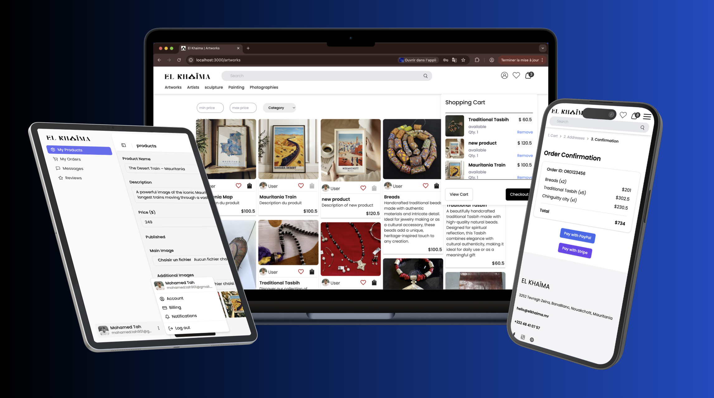

# 🛒 ElKHAÏMA Demo

**ElKHAÏMA** is an **e-commerce platform demo** built with **Next.js (frontend)** and **Spring Boot (backend)**.  
It connects local artisans with their customers, providing a smooth, secure, and modern online shopping experience.

> ⚠️ Note: This is a closed project developed for a private company.

---

---

## 🔹 Features

- **Frontend (Next.js)**  
  - Modern architecture with **Zustand** state management  
  - Clean, responsive **UI/UX** using **Tailwind CSS**  
  - REST API integration with backend demo  
  - Secure authentication and data handling  

- **Backend (Spring Boot)**  
  - Fully structured **REST API**  
  - JWT authentication and **OTP verification**  
  - Clear separation: controllers, services, repositories, security, validation  
  - Demonstrates **best coding practices** in Spring Boot  
